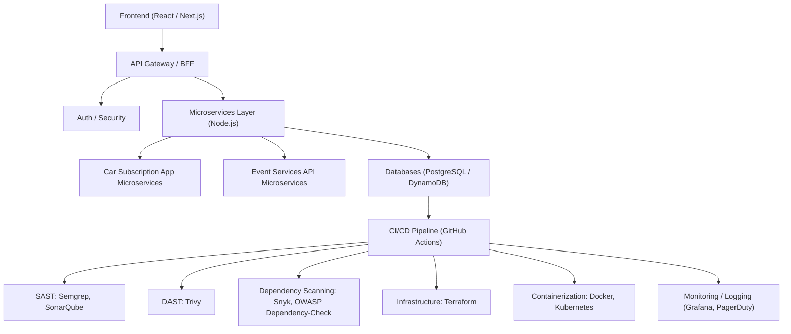

```mermaid
flowchart TD
    A["Frontend (React / Next.js)"] --> B["API Gateway / BFF"]
    B --> C["Auth / Security"]
    B --> D["Microservices Layer (Node.js)"]
    D --> D1["Car Subscription App Microservices"]
    D --> D2["Event Services API Microservices"]
    D --> E["Databases (PostgreSQL / DynamoDB)"]
    E --> F["CI/CD Pipeline (GitHub Actions)"]
    F --> F1["SAST: Semgrep, SonarQube"]
    F --> F2["DAST: Trivy"]
    F --> F3["Dependency Scanning: Snyk, OWASP Dependency-Check"]
    F --> F4["Infrastructure: Terraform"]
    F --> F5["Containerization: Docker, Kubernetes"]
    F --> G["Monitoring / Logging (Grafana, PagerDuty)"]

```